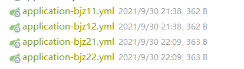
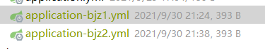

# 2. Eureka-server优化2

# 一. 注册中心多区域

## 1. eureka-server

+ **分区**

> 2个区域：bjz1 *，bjz2 *
>
> 每个区域2个server：
>
> 1. bjz1 * : bjz11, bjz12
> 2. bjz2 * : bjz21, bjz22

+ **port**

> 1. bjz11- 》8811 ,  bjz12 - 》8812
> 2. bjz21 - 》8821，bjz22 - 》8822

+ **yml**

1. **4个yml**

2. **多区域server（业务层）的代码**

~~~yml
server:
  port: 
eureka:
  client:
    register-with-eureka: false
    fetch-registry: false
    region: bj
    availability-zones:
      bj: z1,z2
    service-url:
      z1: http://localhost:8811/eureka/,http://localhost:8812/eureka/
      z2: http://localhost:8821/eureka/,http://localhost:8822/eureka/
spring:
  application:
    name: 
~~~

---

## 2. api-passenger

+ **分区**

> 分别对应eureka-server的两个分区
>
> 2个区域：bj1 ，bj2

+ **port**

> bj1 - > 8701
>
> bj2 - > 8702

+ **yml**

1. **2个yml**

2. **多区域能力层的代码**

~~~yml
server:
  port: 
eureka:
  client:
    service-url:
      z1: http://localhost:8811/eureka/,http://localhost:8812/eureka/
      z2: http://localhost:8821/eureka/,http://localhost:8822/eureka/
    region: bj
    availability-zones:
      bj: (z1/z2)
    # 优先从本区域拉取服务
    prefer-same-zone-eureka: true
  instance:
    metadata-map:
      zone: (z1/z2)
spring:
  application:
    name: api-passenger
zone:
  name: 
~~~

+ **controller层**

~~~java
    @RestController
    public class ZoneController {
        @Value("${zone.name}")
        String name;
        @RequestMapping("/zone")
        public String zone(){
            return name;
        }
    }
~~~

---

## 3. api-consumer

+ **yml配置**

~~~yml
server:
  port: 80
eureka:
  client:
    service-url:
      z1: http://localhost:8811/eureka/,http://localhost:8812/eureka/
      z2: http://localhost:8821/eureka/,http://localhost:8822/eureka/
    region: bj
    availability-zones:
      bj: z1,z2
spring:
  application:
    name: api-consumer
~~~

+ **config配置**

~~~java
@Configuration
public class RestTemplateConfig {
    @Bean
    @LoadBalanced
    public RestTemplate r(){
        return new RestTemplate();
    }
}
~~~

+ **controller**

~~~java
@RestController
public class ZoneController {
    @Autowired
    RestTemplate restTemplate;
    @RequestMapping("/zone")
    public String zone(){

        return restTemplate.getForObject("http://api-passenger/zone",String.class);
    }
    @RequestMapping("/test")
    public String test(){
        return "ssssssss";
    }
}
~~~

