# 2. Eureka-server优化

# 补充知识

## 1. Eureka服务端启动原理

>  **导入eureka-server包和添加@EnableEurekaServer怎么变成了Eureka的服务端**

### 1. 流程图

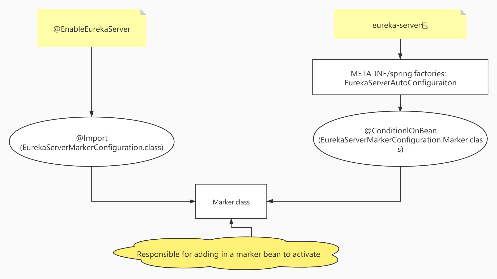

------------------

### 2. 原理分析

1. 添加eureka-server包后,需要扫描该jar包的spring.factories的EurekaServerAutoConfiguration

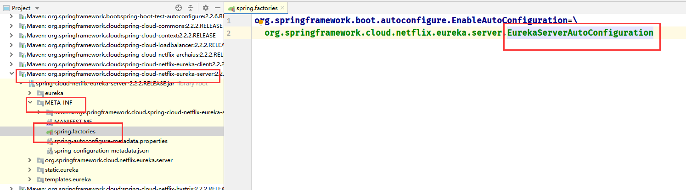

2. 点进去该类后，@ConditionalOnBean里有Marker.class类

3. Marker.class点进去后

4. 添加@EnableEurekaServer注解后，点进去该注解后看到有一个@Import注解

5. 点进EurekaServerMarkerConfiguraion.class(和上面2中的类是同一个)

6. springboot的启动器扫描同级目录的包注解，所以扫描了@EnableEurekaServer，加载eureka-server的jar包，最终变成了Eureka服务端

---

## 2. start（）方法启动原理

> EurekaServerInitializerConfiguration实现SmartLifecycle接口，SmartLifecycle继承Lifecycle接口，Lifecycle接口里有start()方法，在spring初始化和销毁的时候，就会分别调用它的start和stop方法

+ **EurekaServerInitializerConfiguration实现SmartLifecycle接口**

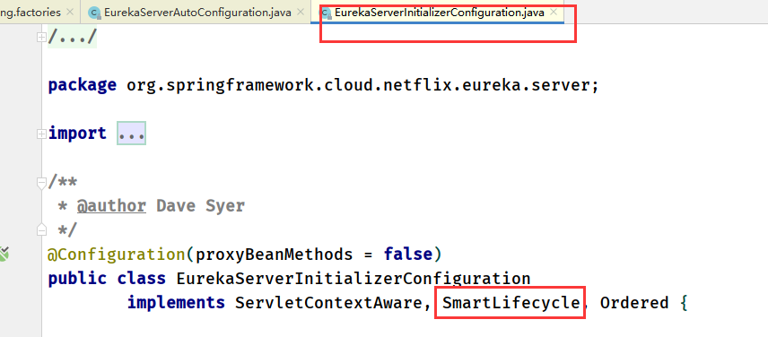

+ **SmartLifecycle继承Lifecycle接口**

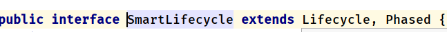

+ **Lifecycle接口里有start()方法**

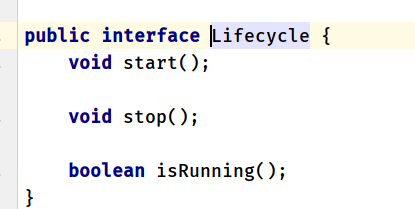

# Eureka优化

# yml优化总配置

~~~yml
  server:
  	# 自我保护，看服务多少。
    enable-self-preservation: false
    # 自我保护阈值
    renewal-percent-threshold: 0.85
    # 剔除服务时间间隔
    eviction-interval-timer-in-ms: 1000
    # 关闭从readOnly读注册表
    use-read-only-response-cache: false
    # readWrite 和 readOnly 同步时间间隔。
    response-cache-update-interval-ms: 1000
~~~

+ 打断点位置路径

> eureka-server的jar包下 --》META-INF的spring.factories --》EurekaServerAutoConfiguration --》
>
> @Import(**EurekaServerInitializerConfiguration**.class)点进去该类 --》start方法

# 一. 自我保护机制

yml配置：

~~~yml
eureka:	
	server:
        # 自我保护
        enable-self-preservation: false
        # 自我保护阈值(关闭自我保护，设置该值没意义)
        renewal-percent-threshold: 0.85
        # 剔除服务时间间隔
        eviction-interval-timer-in-ms: 1000
~~~

## 1. 底层实现原理：

> 达到自我保护阈值，就不会剔除服务

---

## 2. 剔除实现原理

> NumOfRenewsInLastMin：最后一分钟的心跳数（续约数）
>
> numberOfRenewPerMinThreshold：阈值（0.85*注册数）

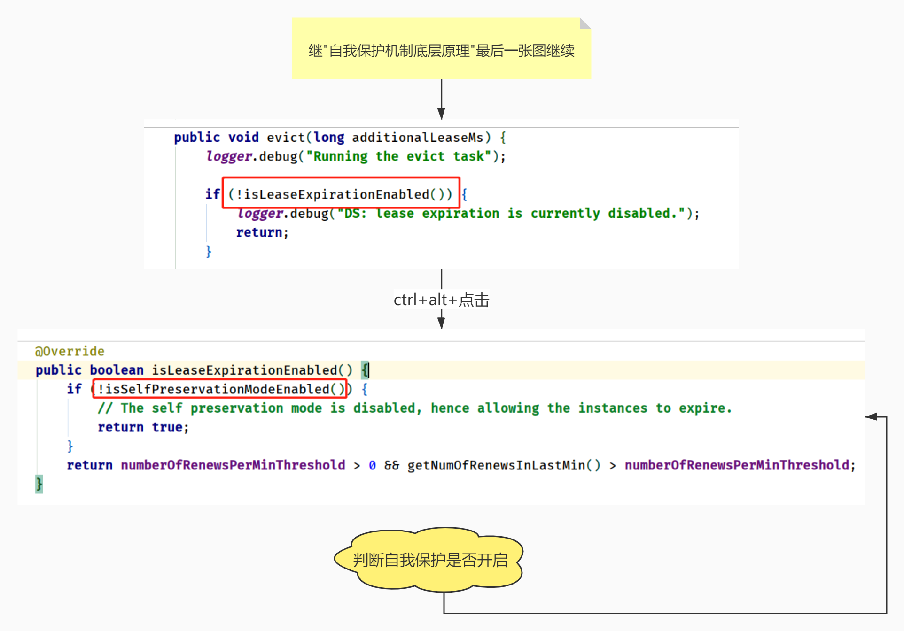

**思维导图**

> 续约，心跳是一个概念

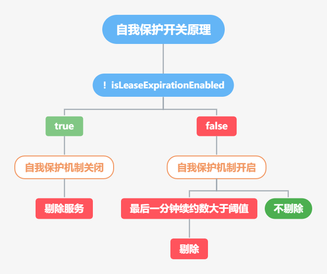

---

# 二. 服务下线以及Timer问题

## 1. Timer问题

> Timer问题：
>
> 多线程并行处理定时任务时，Timer运行多个TimeTask时，只要其中之一没有捕获抛出的异常，其它任务便会自动终止运行，使用ScheduledExecutorService则没有这个问题。

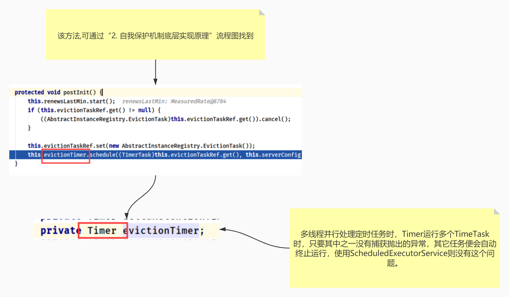

## 2. 服务下线源码（cancelLease）

> 自我保护的剔除的本质：下线
>
> 监听事件——》监听器

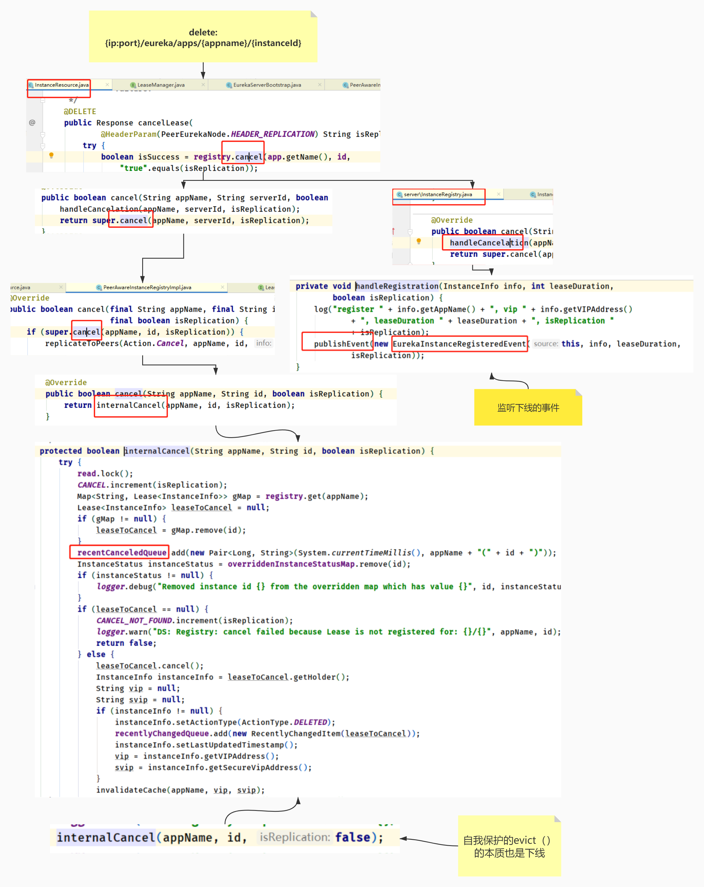

---

# 三.  三级缓存（不分1,2,3级缓存）

## CAP

> CAP：指的是在一个分布式系统中
>
> ​			1. 一致性（Consistency）
>
> ​			2. 可用性（Availability）
>
> ​			3. 分区容错性(Partition tolerance）

## 1. 三级缓存流程图

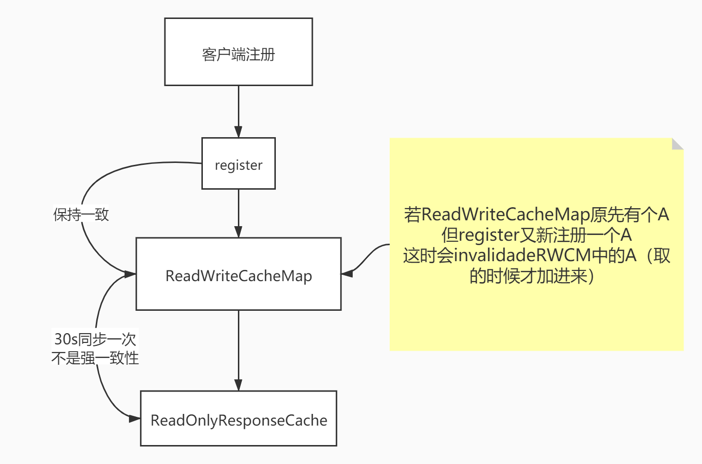

## 2. 三级缓存中没实现c的原因

> 因为读数据是从ReadOnlyResponseCache读取，而ReadOnlyResponseCache与ReadWriteCacheMap同步时间是30s，所以没有实现一致性

## 3. Registry

> registry是ConcurrentHashMap
>
> ConcurrentHashMap<服务名，map<实例id，实例信息>>
>
> ConcurrentHashMap<String, Map<String, Lease<InstanceInfo>>>

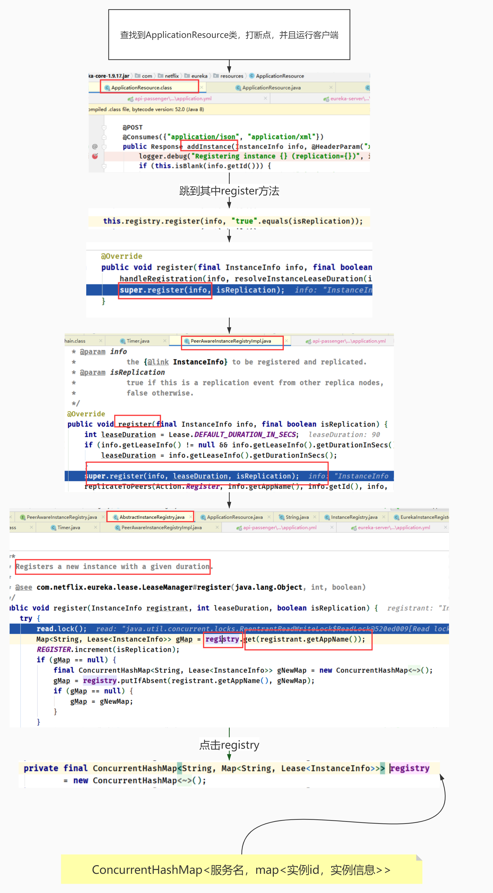

## 4. ReadWriteCacheMap

> ReadWriteCacheMap和Registry缓存实时同步，当registry读取注册表后，会失效ReadWriteCacheMap中缓存相同的字段，如下图
>
> 在取数据的时候在加进来

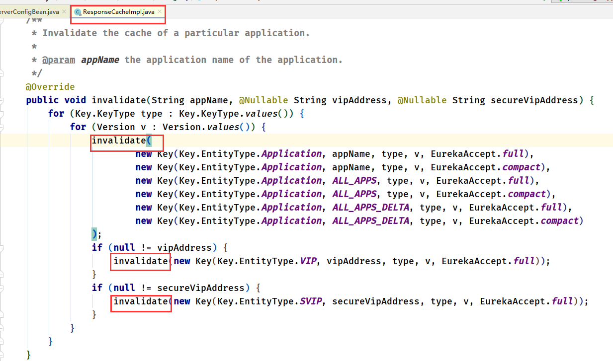

+ **ReadWriteCacheMap相同字段缓存失效** 

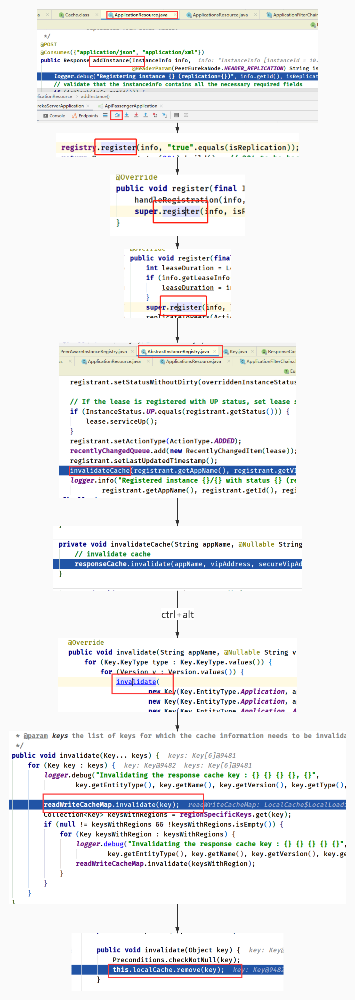

---

+ **ReadWriteCacheMap**读取数据

---

## 5. ReadOnlyResponseCache

> 客户端通过该缓存查询信息，但ReadOnlyResponseCache与ReadWriteCacheMap同步时间是30s，所以不是强一致性

+ **ReadOnsponseCache获取数据**

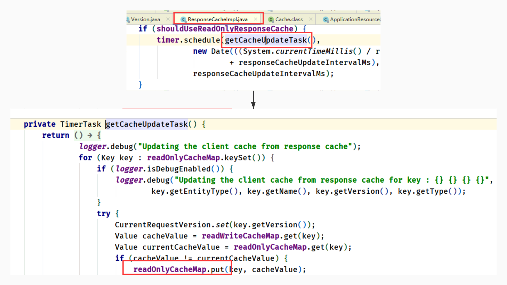

+ **ReadOnlyResponseCache的同步时间由来**

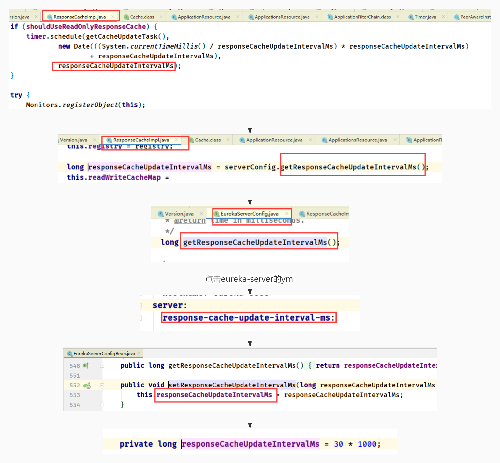

## 6. 读写影响么

> 大量数据塞进register，读是用ReadOnlyResponseCache，所以读写分开，互不影响

## 7. 总结：缓存中可优化的点

### yml

~~~yml
eureka:  
  server:
    # 关闭从readOnly读注册表
    use-read-only-response-cache: false
    # readWrite 和 readOnly 同步时间间隔。
    response-cache-update-interval-ms: 1000
~~~

### 1. 关闭从readOnly读注册表

> 客户端提升查询可用服务的速度，少走if中的语句

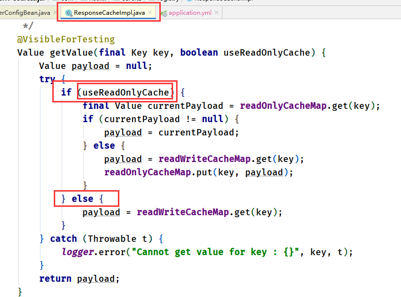

### 2. readWrite 和 readOnly 同步时间间隔。

> 也会提升查询可用服务的速度

# 四. EurekaServerAutoConfiguration

## 1. 缓存开启

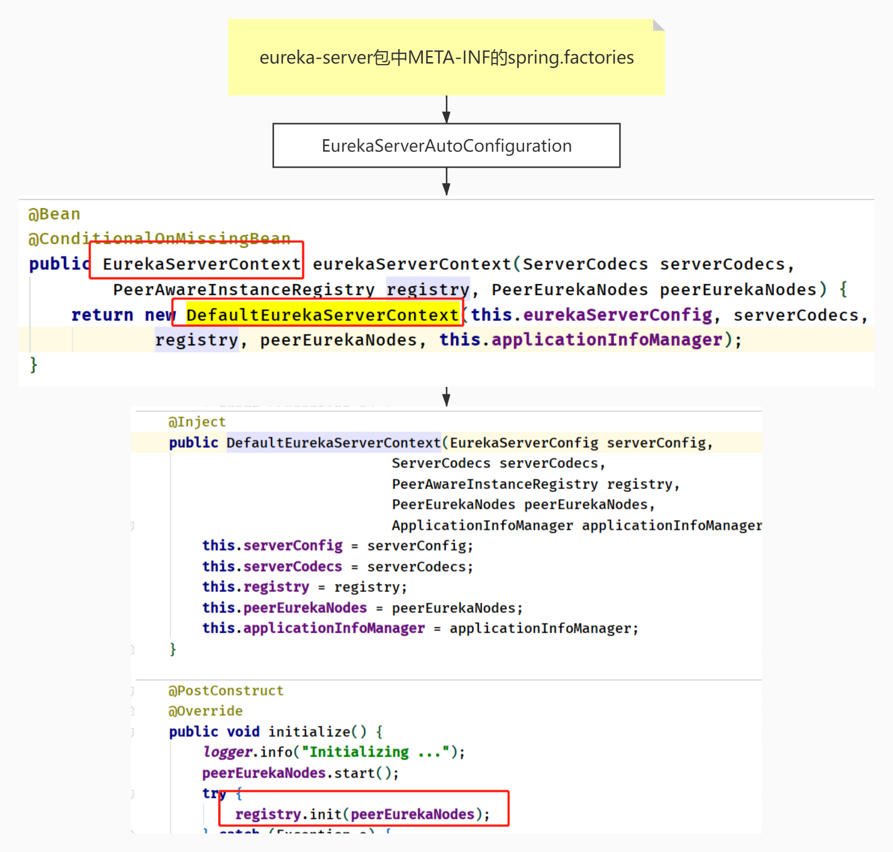

## 2. FilterRegistrationBean

> FilterRegistrationBean对Eureka server 所有的操作都是通过http完成的
>
> 如：{ip}:{port}/eureka/apps/..
>
> 详情使用可看**Ming_SpringCloud_eureka.md**的**三. Eureka的Rest服务调用**

+ 作用：

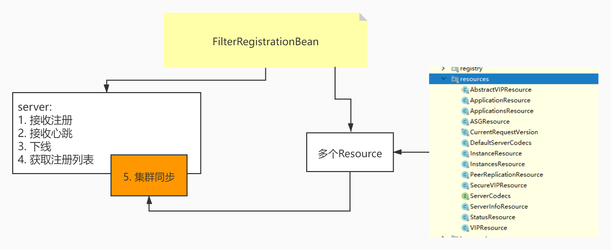

### 2.1 集群同步的实现

> addInstance()为ApplicationResource.java里的方法
>
> 也就是上个图提及N多个Resource中的其中一个
>
> 
>
> 集群同步没保证c的原因
>
> 从其他peer拉取注册表。peer。int registryCount = this.registry.syncUp()，没有满足C的地方。

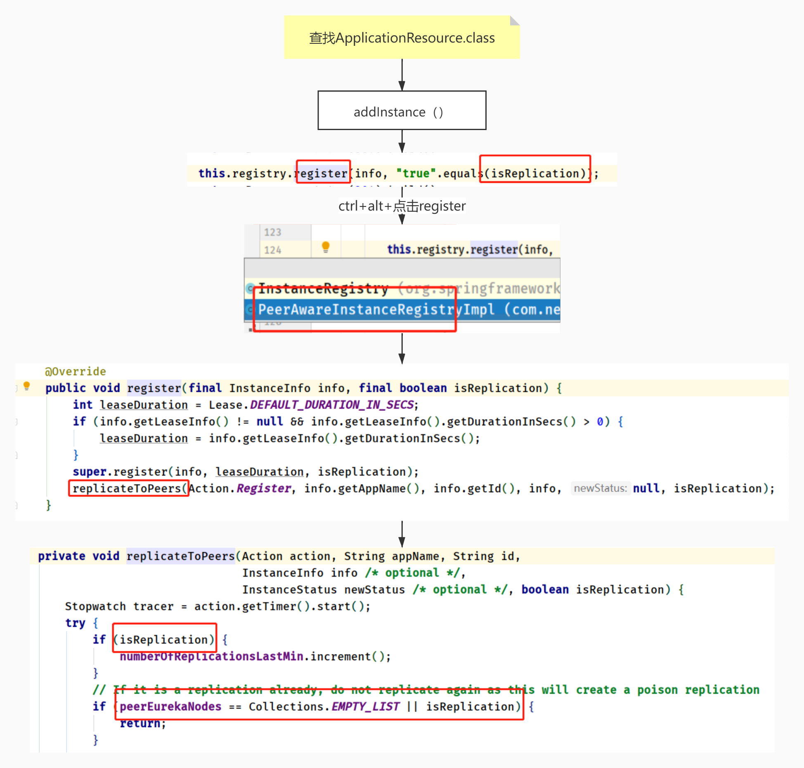

> isReplication解读
>
> 1. true表示是服务节点之间的数据同步
> 2. false表示是客户端请求
>
> 
>
> 假如现在有eureka集群有3个节点 a,b,c.当客户端user将自己的服务信息注册给a节点的时候，a节点要将客户端user的服务信息同步给b，c节点。此时他也是和客户端一样，发送http请求，调用com.netflix.eureka.resources.ApplicationResource#addInstance这个方法，但是b,c节点收到信息后，同样也要同步给其他节点，这时候就会有一个死循环的问题。（a同步给b，c；b同步给a，c；c同步给a,b。这不就死循环了吗。） 当服务节点之间同步数据的时候，isReplication=true。就可以通过下面的代码完美解决。
> if (peerEurekaNodes == Collections.EMPTY_LIST || isReplication) {
> return;
> }

### 2.2 集群同步__节点注册&续约

**节点注册**

> **第一个节点注册：**
>
> peerEurekaNodes == Collections.EMPTY_LIST ：true       isReplication  false
>
> **第二个节点注册：**
>
> 会把isReplication重新设置true，进行同步，同步后，执行下一个方法，返回
>
> peerEurekaNodes == Collections.EMPTY_LIST ：false       isReplication  true

**续约和节点注册流程图**

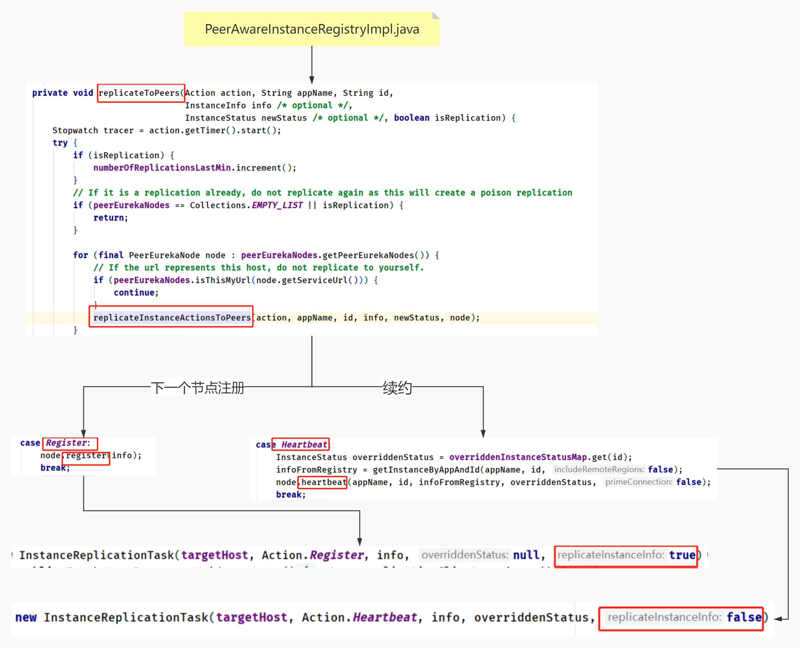

---

# 五. Lease《InstanceInfo》

~~~java
Lease<InstanceInfo>租约     InstanceInfo服务实例
~~~

1. > class 服务实例{
   >
   > ​	T 租约；
   >
   > ​	 holder。setter
   >
   > }

2. > class 租约{
   >
   > ​	long 到期time;
   >
   > ​	long 续约时间time;
   >
   > ​	long 心跳时间time;
   >
   > ​	T 服务实例 holder。setter
   >
   > }

> 第二种的好处：频繁的续约操作，不会影响服务实例

# 六. 服务预算

+ 一个eureka-server承受的量

> 20个eureka-server，每个分别部署5个client，共100个client
>
> 1. client发送心跳数：1min 2次
>
>    100 * 2 * 60 * 24 = 288,000
>
> 2. 每个client还需拉取服务：1min 2次
>
>    288,000 * 2 = 576,000
>
> 3. server同步信息：
>
>    576,000 * （3 + 2）=  **2,880,000**
>
>    > 2  ：共3个server（乘客，司机，司机听单）
>    >
>    > 2  ：client的续约和注册  
>
> 共 **2,880,000**

---

+ 测试一个Eureka  **1W次** client注册和取值的时间：0.1s

> 100,000 -》1s
>
> 性能降低100倍
>
> 1000      -》 1s
>
> 1day： 1000 * 60 * 60 * 24 = 86,400,000

---

**Eureka集群没有扩大承受能力，而是提升了服务的高可用。**

---

# 七. 拉取注册表

## 1. 全量拉取

> entityName : "ALL_APPS"

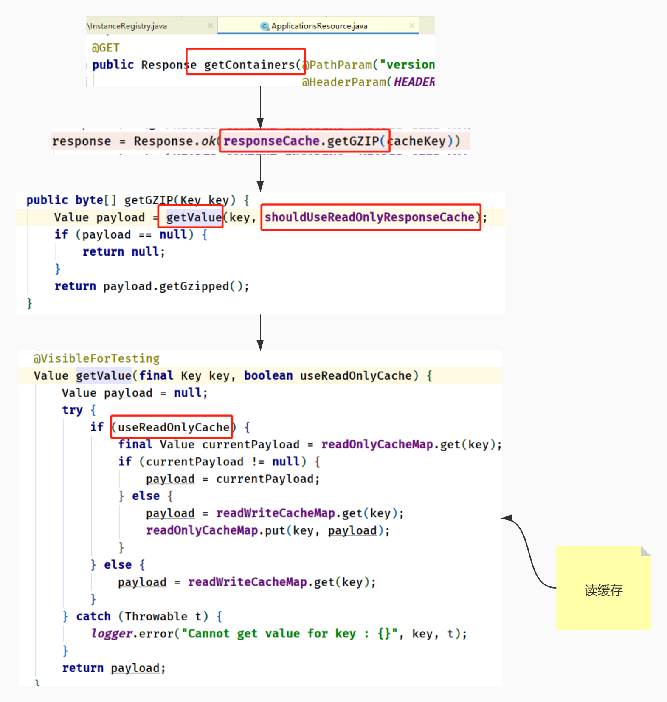

## 2. 增量拉取

> entityName ： "ALL_APPS_DELTA"

---

# 总结

## 1. Eureka-server源码

> 剔除（本质也是下线）。长时间没有心跳的服务，eureka server将它从注册表剔除。
>
> 注册。
>
> 续约。
>
> 下线。
>
> 集群间同步。
>
> 拉取注册表。（all-apps,apps-delta,服务名）

##  2. Eureka实现ap，没有实现c的原因

> 1. 缓存读问题：因为读数据是从ReadOnlyResponseCache读取，而ReadOnlyResponseCache与ReadWriteCacheMap同步时间是30s，所以没有实现一致性
> 2. 集群之间注册表的同步
> 3. 网络波动，不过还是可以拉取到注册表进行调用的。服务还可以调用（自我保护开启的保护，剔除时间间隔还要一段时间，如果不满足则拉取不到）

**集群之间注册表的同步问题**：

https://blog.csdn.net/zzl429556205/article/details/103647695

**集群之间的同步过程**

- Eureka Server也是一个Client，在启动时，通过请求其中一个节点（Server），将自身注册到Server上，并获取注册服务信息；
- 每当Server信息变更后（client发起注册，续约，注销请求），就将信息通知给其他Server，来保持数据同步；
- 在执行同步（复制）操作时，可能会有数据冲突，是通过lastDirtyTimestamp，最近一次变更时间来保证是最新数据；

比如 Eureka Server A 向 Eureka Server B 复制数据，数据冲突有2种情况：

（1）A 的数据比 B 的新，B 返回 404，A 重新把这个应用实例注册到 B。

（2）A 的数据比 B 的旧，B 返回 409，要求 A 同步 B 的数据。

## 3. Eureka优化

优化点的地址：https://blog.csdn.net/weixin_39665762/article/details/112183496

> 1. 自我保护
>
> 2. 快速下线：剔除服务时间缩短
>
> ~~~yml
> # 剔除服务时间间隔
>     eviction-interval-timer-in-ms: 1000
> ~~~
>
> 3. Timer
>
> 4. 缓存

## 4. 单节点是否保证一致性问题

> 如果是多节点的话，就涉及集群同步中不保证c的原因了

保证一致性，搭建的是单节点的话，userReadOnlyCache设置false，代码走ReadWriterCache了，虽然看着保证了一致性，但还有网络波动问题导致不是一致性，如下图

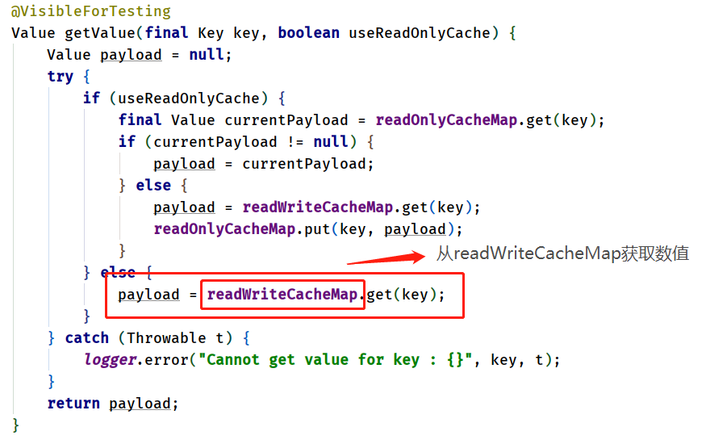