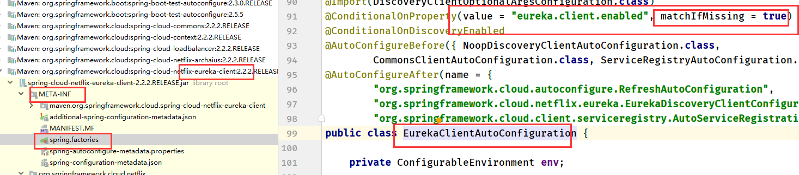
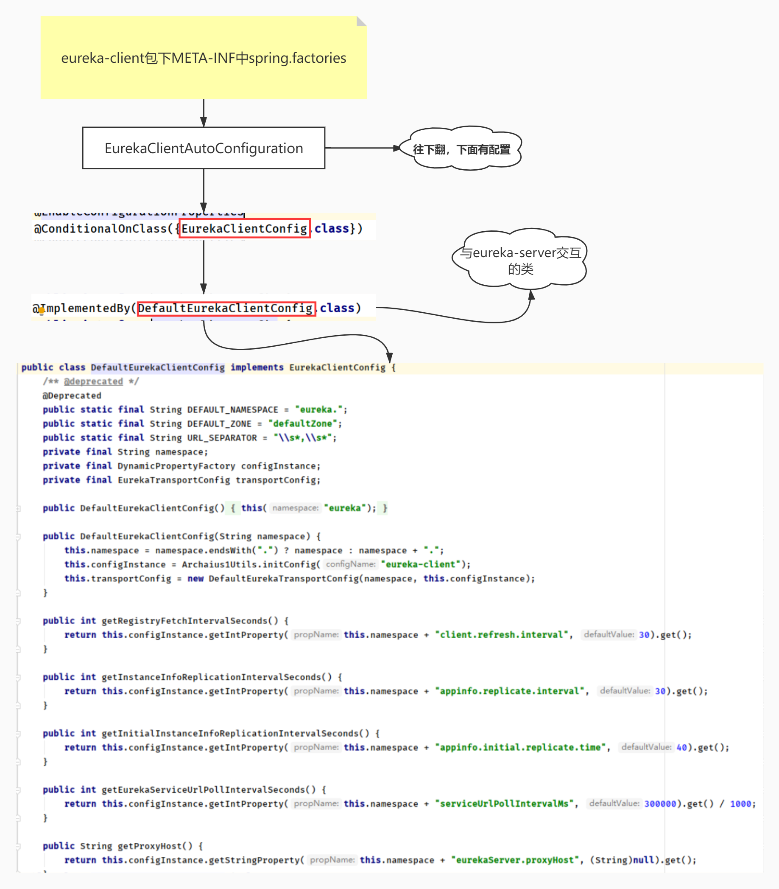
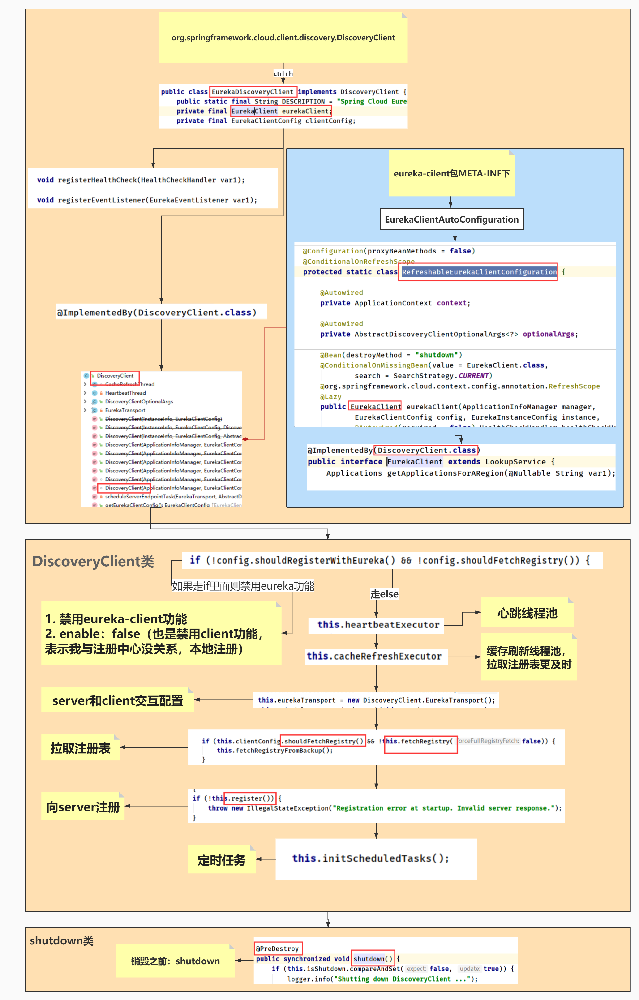
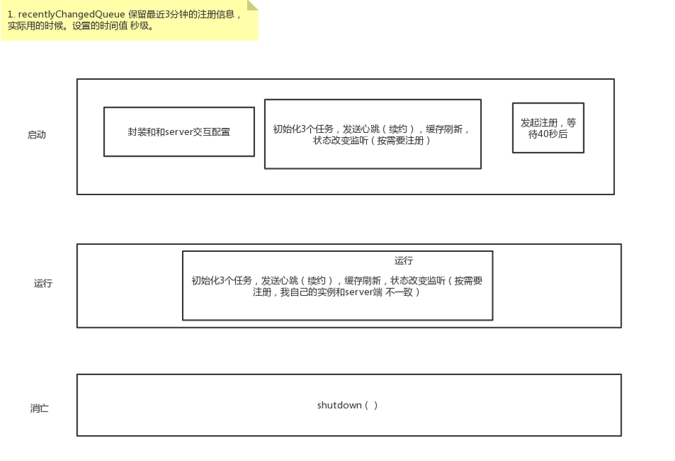
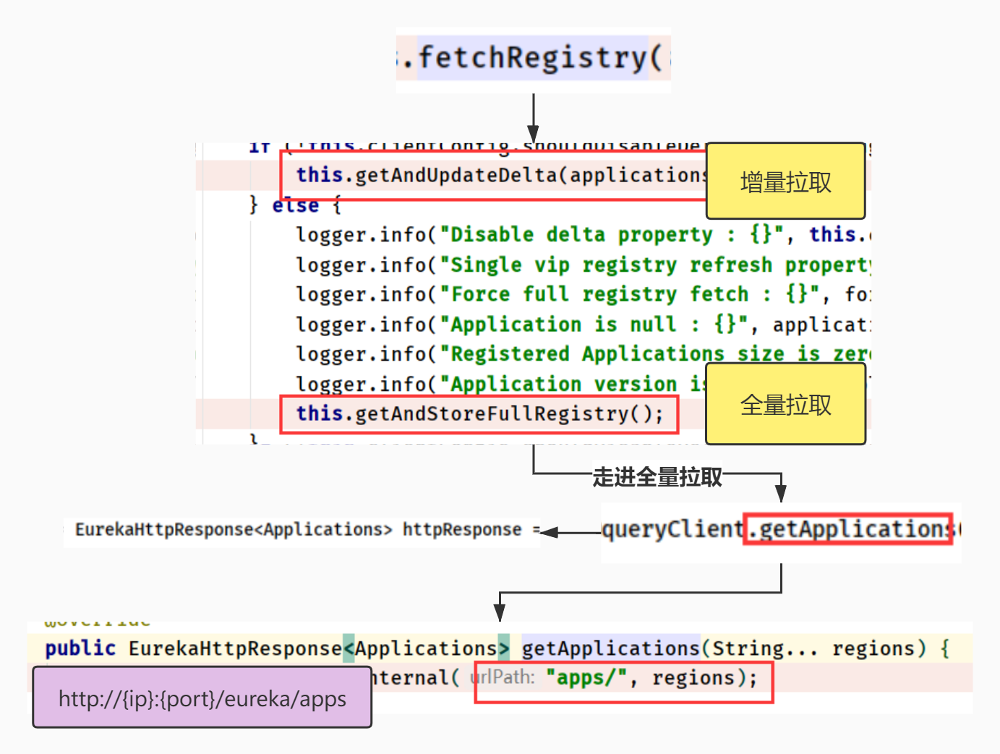
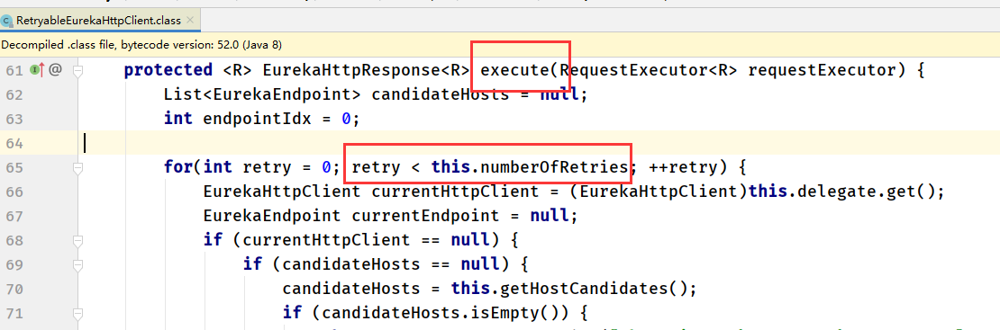

# Eureka-client优化

# Eureka-client不用写@EnableEurekaClient的原因

> 设置成true，而eureka-server需要用marker做标记默认是false，所以要写注解

# 一. EurekaClientAutoConfiguration

> eureka-client的配置注入包

+ 与server交互的配置包

  > 会初始化参数配置

# 二. DiscoveryClient

## 1.1 EurekaDiscoveryClient

> 作用：
>
> 1. 封装和server交互配置（拉取注册表，向server注册）
> 2. 缓存刷新：拉取注册表更及时
> 3. 发送心跳（续约）
> 4. 监听自身服务状态

+ 老师的流程图

## 1.2 FetchRegistry

> http://{ip}:{port}/eureka/apps-》全量拉取得到

## 1.3 initScheduleTasks(定时任务)

> 1. 缓存刷新
> 2. 发送心跳（续约）
> 3. 监听自身服务状态（按需要注册）

# 三. server-url（每启动一个节点，调url顺序）

> 在实际工作中，要把url随机打乱，配置中心配置动态ip，如果有n个往第一个url里注册，服务端承受不住

> 集群同步的目的：比如往第一个url注册了，第一个url就会和第2,3个url集群同步

~~~yml
eureka:
  client:
    service-url:
      defaultZone: http://eureka-8888:8888/eureka，http://eureka-8888:8888/eureka
~~~

> 客户端注册时，注册的都从第一个url注册，如果第一个注册失败，从第二个里注册
>
> 如果有4个url，前三个都注册不了，会抛异常，因为底层的numberOfRetries是3
>
> 所以一般设置都设置3个，第四个不生效，但也可以改变默认值numberOfRetries

# 总结

# Eureka-client优化的点

1. 注册表的拉取服务的时间间隔
2. 心跳续约时间间隔
3. 续约到期时间
4. 设置饥饿加载，防止第一次请求超时
5. server-url: 打乱配置，不让所有服务不写相同的顺序

