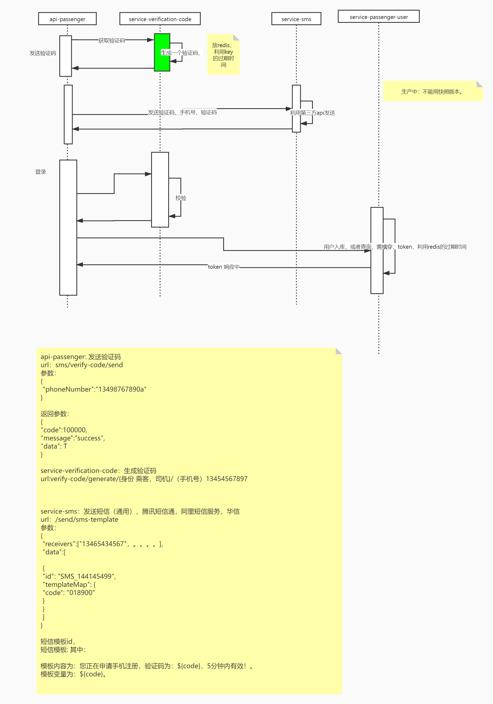
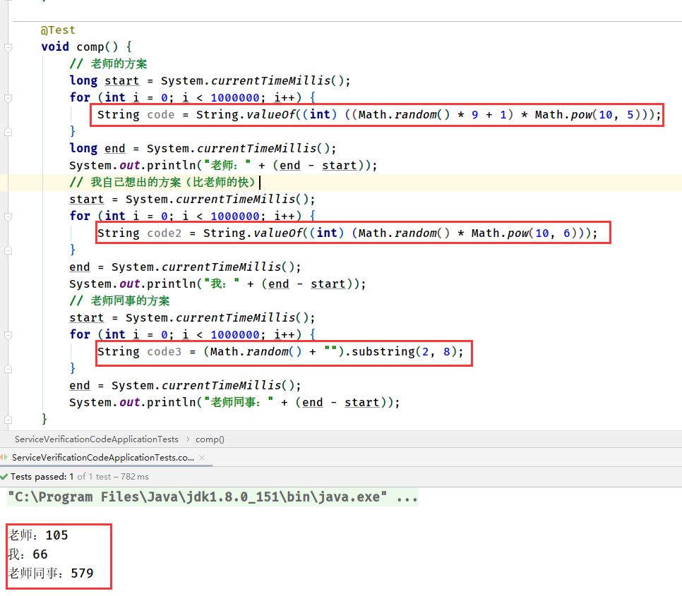
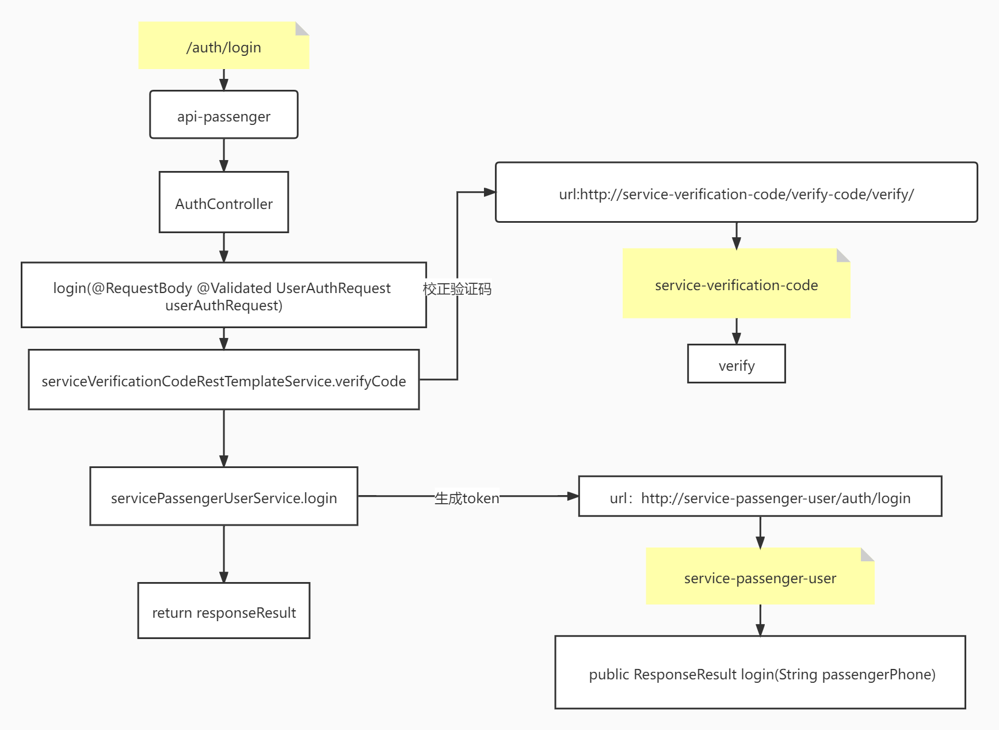
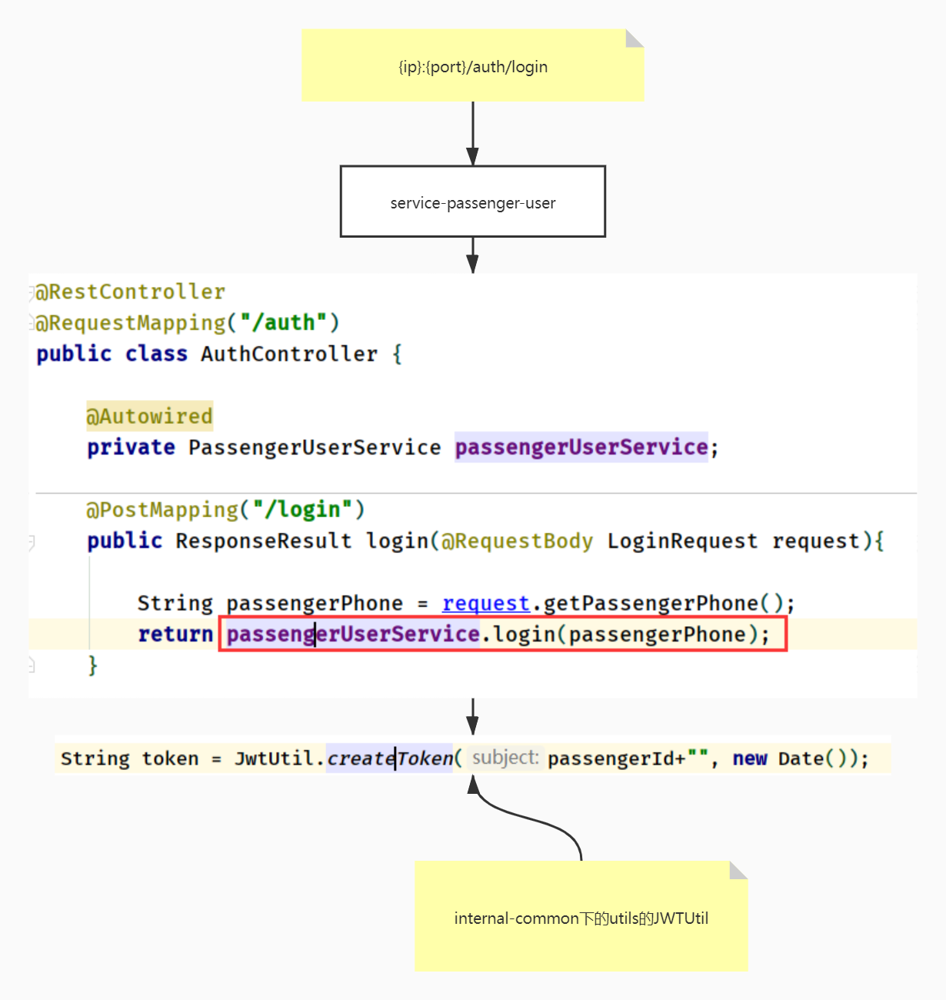

# 6. 短信服务

# 时序图



# 知识点

dto:对象传输模型

一方库：本工程中的各模块的相互依赖

**二方库：公司内部的依赖库，一般指公司内部的其他项目发布的jar包**（internal-common）

三方库：公司之外的开源库， 比如apache、ibm、google等发布的依赖

# 一. 验证码

## 1. 生成六位验证码

~~~java
String code = String.valueOf((int)((Math.random() * 9 + 1) * Math.pow(10,5)));
~~~

### 其他验证码方案

方案1：

~~~java
// 错误：0.012345 -> 12345
String code2 = String.valueOf((int)(Math.random()*Math.pow(10,6)))
~~~

方案2：

~~~java
// [2,8) -》 0.123456 -》123456
String code3 = (Math.random()+"").substring(2,8)
~~~

### 压测结果展示

> 我的是错误的
>
> 如果随机数是0.012345，就错了
>
> 而老师的从1开头



## 2. 验证码相关问题

### Math.random()小数问题

> 生成的小数位数足够有6位以上（double精确到7位有效数字）


### substring：Math.random为什么加“ ”

> string类型才可以调用substring
>
> Math.random生成的是double，加上空字符串会类型转变成字符串
>
> byte,short,char-->int--->long--->float--->double-->string

# 二. 提升QPS(吞吐量)优化

## 1. 提高并发数

1. 能用多线程用多线程

   > 线程数计算： 
   >
   > 线程数 = cpu可用核数 / （1-阻塞系数）
   >
   > 阻塞系数：io密集型接近1，计算密集型接近0

2. 增加各种连接数：tomcat，mysql，redis等

3. 服务无状态，便于横向扩展，扩机器

4. 让服务能力对等（eureka-server-defaultZone的url顺序打乱）

## 2. 减少响应时间

1.  异步（最终一致性，不需要及时），流量削峰

   > 异步：
   >
   > 火车票通知问题
   >
   > 没必要等短信发完，在给用户返回

2. 缓存。（减少db读取，减少磁盘io，读多，写少，如redis缓存）

3. 数据库优化。

4. 多的数据，分批次返回。

5. 减少 调用链。

6. 长连接。不要 轮询（）

# 三. 放内存，放Redis缓存问题

1. 数据量少放内存

>  如短信模板内容，80B
>
> 1024B = 1K
>
> 1024K = 1M
>
> 相当于（1024*1024）/ 80 = 13,107 次

2. 超过50M，100M放redis

# 四. api-passenger（短信验证流程）

> 涉及模块：
>
> service-verification-code
>
> service-sms

## 1. send  (生成验证码，发送短信)

流程图


### 1.1 生成验证码


### 1.2 发送短信


## 2. login （验证码校验，以及token生成）



# 五. service-passenger-user

## token存放位置问题

~~~markdown
# 场景：如果司机出现酒驾等，通过token失效，使其不能登录
**根据业务写技术**


1. 若是长链接的话，不用存放在redis缓存中，而是服务端直接通过内存就可获得token使其失效

2. 若为短连接，每次会话才是一次连接，所以才存放在redis缓存
~~~

---

## 1. login（生成jwt的token）



## 2. JWTUtil

~~~java
public class JwtUtil {
    /**
     * 密钥，仅服务端存储
     */
    private static String secret = "ko346134h_we]rg3in_yip1!";

    /**
     * @param subject
     * @param issueDate 签发时间
     * @return
     */
    public static String createToken(String subject, Date issueDate) {
        String compactJws = Jwts.builder()
                .setSubject(subject)
                .setIssuedAt(issueDate)
//                .setExpiration(issueDate + xxx)
                .signWith(io.jsonwebtoken.SignatureAlgorithm.HS512, secret)
                .compact();
        return compactJws;

    }

    /**
     * 解密 jwt
     * @param token
     * @return
     * @throws Exception
     */
    public static JwtInfo parseToken(String token) {
        try {
            Claims claims = Jwts.parser().setSigningKey(secret).parseClaimsJws(token).getBody();
            if (claims != null){
                JwtInfo ji = new JwtInfo();
                ji.setSubject(claims.getSubject());
                ji.setIssueDate(claims.getIssuedAt().getTime());
                return ji;
            }
        }catch (ExpiredJwtException e){
            e.printStackTrace();
            System.out.println("jwt过期了");
        }

        return null;
    }
}
~~~


# 五. cloud-zuul

## 过滤器

https://blog.csdn.net/u011066470/article/details/106735691

> 继承zuulfilter后
>
> 重写 ：
>
> 1. shouldfilter()
> 2. run()
> 3. filterType()
> 4. filterOrder()

~~~java
@Component
public class AuthFilter extends ZuulFilter {

	@Autowired
	private RedisTemplate<String, String> redisTemplate;

	/**
	 * 	该过滤器是否生效
	 */
	@Override
	public boolean shouldFilter() {
		//获取上下文
		RequestContext requestContext = RequestContext.getCurrentContext();
		HttpServletRequest request = requestContext.getRequest();
		return false;
	}
	
	/**
	 * 	拦截后的具体业务逻辑
	 */
	@Override
	public Object run() throws ZuulException {
		System.out.println("auth 拦截");
		//获取上下文（重要，贯穿 所有filter，包含所有参数）
		RequestContext requestContext = RequestContext.getCurrentContext();
		HttpServletRequest request = requestContext.getRequest();

		String token = request.getHeader("Authorization");
		if (StringUtils.isNotBlank(token)){
            JwtInfo tokenJwtInfo = JwtUtil.parseToken(token);

            if(null != tokenJwtInfo) {
                String tokenUserId = tokenJwtInfo.getSubject();
                Long tokenIssueDate = tokenJwtInfo.getIssueDate();

				requestContext.set("userId",tokenUserId);

				return null;
        // 不往下走，还走剩下的过滤器，但是不向后面的服务转发。
        requestContext.setSendZuulResponse(false);
        requestContext.setResponseStatusCode(HttpStatus.UNAUTHORIZED.value());
        requestContext.setResponseBody("auth fail");

//        requestContext.set("ifContinue",false);

		return null;
	}
	/**
	 * 拦截类型，4种类型。
	 */
	@Override
	public String filterType() {
		// 什么时候执行
		return FilterConstants.PRE_TYPE;
	}

	/**
	 * 	值越小，越在前
	 */
	@Override
	public int filterOrder() {
		// 值越小越先执行（如若有多个filter类的话）
		return -1;
	}
}
~~~


# 六. 编程细节

## validation

> - springboot2.2.7.release版本包含validation包

## 枚举的引用

## lombok

```
@Accessors(chain = true)
```

责任链