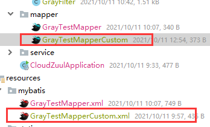

# 灰度发布

~~~markdown
面试官：怎么做的
我：
1. 解决的问题是什么？为什么用灰度发布。(实验新功能A/B,小改动服务，尽量减少用户的使用的时延，便于小步快跑（小功能）)
2. 遇到的问题，怎么解决的
3. 为什么这么解决（蓝绿发布，滚动发布，灰度发布）
4. 给公司带来的好处(节省了服务器，节省了延时，试错成本)
~~~

~~~markdown
# 1.概念
- A/B测试
- 灰度发布只升级部分服务，即让一部分用户继续用老版本，一部分用户开始用新版本，如果用户对新版本没什么意  	见，那么逐步扩大范围，把所有用户都迁移到新版本上面来。
# 2.步骤
1. 制定灰度规则，区分哪些用户，走哪些服务（boss后台录入规则）
2. 预制规则代码
3. 修改元数据
~~~

# 一. 蓝绿发布，滚动发布

https://www.cnblogs.com/xiaobaicai12138/p/14919318.html

~~~markdown
# 1.蓝绿发布
- 缺陷：
1、需要准备正常业务使用资源的两倍以上服务器，防止升级期间单组无法承载业务突发；
2、短时间内浪费一定资源成本；
3、基础设施无改动，增大升级稳定性。
# 2.滚动发布
- 缺陷：
1、部署时间慢，取决于每阶段更新时间；
2、发布策略较复杂；
3、无法确定OK的环境，不易回滚。
~~~

# 二. 灰度发布——3种落地方案

## 数据库字段更改

~~~markdown
# 1.通过全局替换
~~~

---

~~~markdown
# 2.新建mapper接口继承原先的接口，新建mapper.xml文件，通过更改原先的动态sql字段进行引入到新建的mapper.xml文件
- 缺陷：所修改的字段查询null，但不影响其余字段查询（解燃眉之急）
~~~

+ 层级目录：

+ mapper接口：

~~~java
@Mapper
public interface GrayTestMapperCustom extends GrayTestMapper {
    	// 方法自己定义，不用和原先接口一样
        public List<GrayTest> select();
}
~~~

+ xml:

  + GrayTestMapper.xml的动态sql字段更改

    原先的动态sql

    ~~~xml
    	<sql id="Base_Column_List">
            id, user_id, version
        </sql>
    ~~~

    数据库字段更改后的动态sql

    > 若不修改，查询时会出错：BadSqlGrammarException

    ~~~xml
    	<sql id="Base_Column_List">
            idd, user_id, version
        </sql>
    ~~~

  + 新建的xml，引入GrayTestMapper.xml的动态sql

    ~~~xml
    <include refid="com.zhanghp.cloudzuul.mapper.GrayTestMapper.Base_Column_List"></include>
    
    ~~~

---

## 前置知识：更新元数据

> - **更新元数据后，需等30s注册到注册中心上去，立即查询还是老样子**

PUT：{ip}:{port} /eureka/eureka/apps/**appID**/**instanceID**/metadata?key=value

如:

> http://localhost:8888/eureka/apps/GRAY-PROVIDER/DESKTOP-829DDC6:gray-provider:9002/metadata?version=v2

## 前置配置

1. **RestTemplate：**

~~~java
@Configuration
public class RestConfig {
    @LoadBalanced
    @Bean
    public RestTemplate rest(){
        return new RestTemplate();
    }
}
~~~

2. **Controller：**

~~~java
@RestController
public class GrayController {
    @Autowired
    RestTemplate restTemplate;
    @RequestMapping("/port")
    public String port(){
        return restTemplate.getForObject("http://gray-provider/port",String.class);
    }
}
~~~

3. **gray-provdier模块集群**

   **yml：**

   ~~~yml
   eureka:
     client:
       service-url:
         defaultZone: http://eureka-8888:8888/eureka
   ---
   spring:
     profiles: v1
     application:
       name: gray-provider
   server:
     port: 9001
   eureka:
     instance:
       metadata-map:
         version: v1
   ---
   spring:
     profiles: v2
     application:
       name: gray-provider
   server:
     port: 9002
   eureka:
     instance:
       metadata-map:
         version: v2
   ~~~

   **controller：**

   ~~~java
   @RestController
   public class grayController {
       @Value("${server.port}")
       String port;
       @RequestMapping("/port")
       public String port(){
           return "gray-provider"+port;
       }
   }
   ~~~

---

## 1. zuul过滤器配置灰度发布（RibbonFilterContextHolder）

~~~markdown
# 1.导包
~~~

~~~xml
		<!-- 实现通过 metadata 进行灰度路由 -->
        <dependency>
            <groupId>io.jmnarloch</groupId>
            <artifactId>ribbon-discovery-filter-spring-cloud-starter</artifactId>
            <version>2.1.0</version>
        </dependency>
~~~

---

~~~markdown
# 2.过滤器类配置
- 前端传来的参数：userId（为了省事）
- 一般采用token放在请求参数的Header，进行解析得到用户，查库，得到version来进行灰度发布
~~~

~~~java
@Component
public class GrayFilter extends ZuulFilter {
    @Override
    public String filterType() {
        return FilterConstants.ROUTE_TYPE;
    }

    @Override
    public int filterOrder() {
        return 0;
    }

    @Override
    public boolean shouldFilter() {
        return true;
    }

    @Override
    public Object run() throws ZuulException {
        RequestContext currentContext = RequestContext.getCurrentContext();
        HttpServletRequest request = currentContext.getRequest();
        int userId = Integer.parseInt(request.getHeader("userId"));
        // 查库（略）
        // 灰度
        if (userId == 1) {
            RibbonFilterContextHolder.getCurrentContext().add("version","v1");
        }else if(userId == 2){
            RibbonFilterContextHolder.getCurrentContext().add("version","v2");
        }
        return null;
    }
}
~~~

## 2. 服务间调用：自定义IRule

> **使用Threadlocal原因：在一个线程里传参数**

~~~markdown
# 1.自定义IRule
~~~

~~~java
@component
public class GrayRule extends AbstractLoadBalancerRule {

    /**
     * 根据用户选出一个服务
     * @param iClientConfig
     * @return
     */
    @Override
    public void initWithNiwsConfig(IClientConfig iClientConfig) {
    }
    @Override
    public Server choose(Object key) {

        return choose(getLoadBalancer(),key);
    }

    public Server choose(ILoadBalancer lb, Object key){

        System.out.println("灰度  rule");
        Server server = null;
        while (server == null){
            // 获取所有 可达的服务
            List<Server> reachableServers = lb.getReachableServers();

            // 获取 当前线程的参数 用户id verion=1
            Map<String,String> map = RibbonParameters.get();
            String version = "";
            if (map != null && map.containsKey("version")){
                version = map.get("version");
            }
            System.out.println("当前rule version:"+version);

            // 根据用户选服务
            for (int i = 0; i < reachableServers.size(); i++) {
                server = reachableServers.get(i);
                // 用户的version我知道了，服务的自定义meta我不知道。

                // eureka:
                //  instance:
                //    metadata-map:
                //      version: v2
                // 不能调另外 方法实现 当前 类 应该实现的功能，尽量不要乱尝试
                Map<String, String> metadata = ((DiscoveryEnabledServer) server).getInstanceInfo().getMetadata();
                String version1 = metadata.get("version");
                // 服务的meta也有了，用户的version也有了。
                if (version.trim().equals(version1)){
                    return server;
                }
            }
        }
        // 怎么让server 取到合适的值。
        return server;
    }
}
~~~

~~~markdown
# 2.config类
~~~

~~~java
public class GrayRibbonConfiguration {
    @Bean
    public IRule ribbonRule(){
        // 自定义的IRule
        return new GrayRule();
    }
}
~~~

~~~markdown
# 3.切面类
~~~

~~~java
@Aspect
@Component
public class GrayAspect {
    @Pointcut("execution(public String com.zhanghp.controller.*.port())")
    private void anyMethod(){}

    @Before(value = "anyMethod()")
    public void before(JoinPoint joinPoint){
        HttpServletRequest request = ((ServletRequestAttributes)RequestContextHolder.getRequestAttributes()).getRequest();
        String version = request.getHeader("version");
        Map<String,String> map = new HashMap<>();
        map.put("version",version);
        RibbonParameters.set(map);
    }
}
~~~

~~~markdown
# 4. Threadlocal类
~~~

~~~java
@Component
public class RibbonParameters {
    private static final ThreadLocal LOCAL = new ThreadLocal();

    public static <T> T get(){
        return (T)LOCAL.get();
    }
    public static <T> void set(T t){
        LOCAL.set(t);
    }
}
~~~

---

## 3. 服务间调用：RibbonFilterContextHolder

~~~markdown
# 1.导包
~~~

~~~xml
		<!-- 实现通过 metadata 进行灰度路由 -->
        <dependency>
            <groupId>io.jmnarloch</groupId>
            <artifactId>ribbon-discovery-filter-spring-cloud-starter</artifactId>
            <version>2.1.0</version>
        </dependency>
~~~

~~~markdown
# 2.切面配置类
~~~

~~~java
@Aspect
@Component
public class GrayAspect {
    @Pointcut("execution(public String com.zhanghp.controller.*.port())")
    private void anyMethod(){}
    /**
     * 第三种灰度方法
     * @param joinPoint
     */
    @Before(value = "anyMethod()")
    public void before(JoinPoint joinPoint){
        HttpServletRequest request = ((ServletRequestAttributes) RequestContextHolder.getRequestAttributes()).getRequest();
        String version = request.getHeader("version");
        if (version.trim().equals("v1")) {
            RibbonFilterContextHolder.getCurrentContext().add("version","v1");
        }
    }
}
~~~

