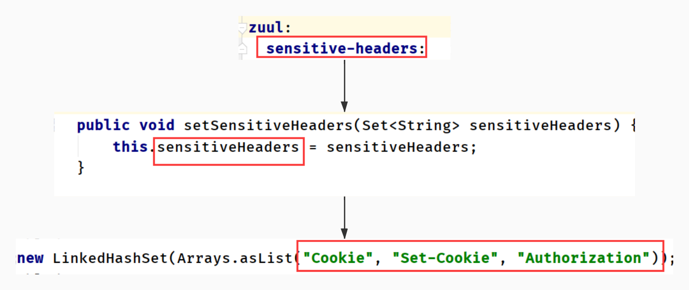
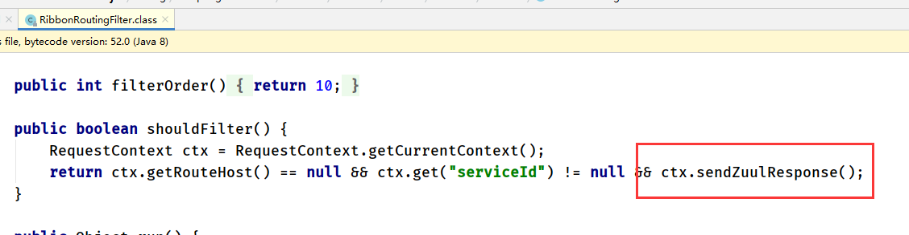

# 8. 网关

# 一. 网关的配置

~~~yml
zuul:
  # 忽略的服务
  ignored-services:
  # 前缀
  prefix: /api
  # 是否移除前缀
  strip-prefix: true
  routes:
  	#此处名字随便取
    custom-zuul-name: 
      # 访问该路径跳到指定地址
      path: /zuul-custom-name/**
      url: http://localhost:9002/
    xx:
      path: /xx/**
      url: http://mashibing.com
# 负载均衡：不是eureka的service-id，我们自定义的，随便写的     
no-eureka-api-driver:
  ribbon: 
    listOfServers: localhost:9003,localhost:9002
~~~

# 二. 网关的作用

~~~markdown
1. 分发服务
2. 身份认证，鉴权
3. 过滤请求
4. 监控
5. 动态路由
6. 限流
~~~

# 三. cookie从网关传不到服务

**yml添加配置**

~~~yml
zuul:
  sensitive-headers:
~~~

**底层**

> 迪米特原则（最小知道原则）：3个人知道，就不让第四个人知道

# 四. 网关的4种过滤器

## 1. 四种过滤器

~~~markdown
1. PRE
2. ROUTE
3. POST
4. ERROR
~~~

## 2. 执行顺序

~~~markdown
1. PRE：在请求被路由调用之前，可鉴权，选择微服务，记录日志，限流
2. ROUTE: 在将请求路由到微服务调用，用于构建发送微服务的请求
		  - ROUTE有3种
		  1. RibbonxxFilter:          路由-》服务
		  2. SimpleHostRoutingFilter: 路由 -》 url地址
		  3. SendForwardFIlter:       转发（专向zuul自己） 
3. POST: 调用微服务执行后，用于添加header，记录日志，讲响应发送客户端
4. ERROR: 在其他阶段发生错误，走此过滤器
~~~

**底层**

# 五. 面试：老项目向微服务改造时遇到的问题

## 404找不到地址

~~~markdown
# 网关的路由地址的来源
1. eureka服务，zuul从eureka服务获取
2. 配置文件yml自定义
~~~

## 1. 路由到服务

~~~markdown
# 需求：
- 将url的test31路径转为服务提供的test3
~~~

创建路由过滤器的类，重写4个方法

~~~java
@Component
public class RouteToServiceFilter extends ZuulFilter {
    @Override
    public String filterType() {
        return FilterConstants.ROUTE_TYPE;
    }

    @Override
    public int filterOrder() {
        return 0;
    }

    @Override
    public boolean shouldFilter() {
        return true;
    }

    @Override
    public Object run() throws ZuulException {
        RequestContext currentContext = RequestContext.getCurrentContext();
        HttpServletRequest request = currentContext.getRequest();
        String remoteURL = request.getRequestURI();
        if (remoteURL.contains("test31")) {
            currentContext.set(FilterConstants.SERVICE_ID_KEY,"gray-consumer");
            currentContext.set(FilterConstants.REQUEST_URI_KEY,"/test3");
        }
        return null;
    }
}
~~~

## 2. 路由到具体地址

~~~markdown
# 需求：
- 讲url指定到具体地址（不是通过spring.application.name，而是具体的地址）
~~~

> filter寻找url会向eureka注册中心查找，yml查找
>
> 所以要配yml自定义具体地址

~~~yml
zuul:
  routes:
    gray-consumer:
      path: /gray-consumer/**
      url: http://localhost:9000/
  sensitive-headers:
~~~

filter

~~~java
@Component
public class RouteToServiceFilter extends ZuulFilter {
    @Override
    public String filterType() {
        return FilterConstants.ROUTE_TYPE;
    }

    @Override
    public int filterOrder() {
        return 0;
    }

    @Override
    public boolean shouldFilter() {
        return true;
    }

    @Override
    public Object run() throws ZuulException {
        RequestContext currentContext = RequestContext.getCurrentContext();
        HttpServletRequest request = currentContext.getRequest();
        String remoteURL = request.getRequestURI();
        if (remoteURL.contains("test31")) {
            currentContext.set(FilterConstants.SERVICE_ID_KEY,"gray-consumer");
            currentContext.set(FilterConstants.REQUEST_URI_KEY,"/test3");
            // 指定跳转的地址
            try {
                currentContext.setRouteHost(new URI("http://localhost:9000/").toURL());
            } catch (MalformedURLException e) {
                e.printStackTrace();
            } catch (URISyntaxException e) {
                e.printStackTrace();
            }
        }
        return null;
    }
}
~~~

## 3. 过滤器开关

~~~markdown
# 作用：不重启，让过滤器生效
~~~

## 4. ip限流

~~~markdown
# 限流的作用：
- 保证使用有限的资源提供最大化的服务能力，按照预期流量提供服务，超过的部分将会拒绝服务、排队或等待、降   级等处理
# ip过滤：次数限制，设备号过滤，选PRE过滤器
~~~

**流程图：**

> **PRE过滤器**

**在重写的run（）方法里添加**

~~~java
		// 不向后面过滤器执行，因为RibbonRoutingFilter的shouldfilter判断了条件
        currentContext.setSendZuulResponse(false);
~~~

**RibbonRoutingFilter源码**

